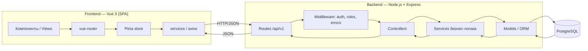
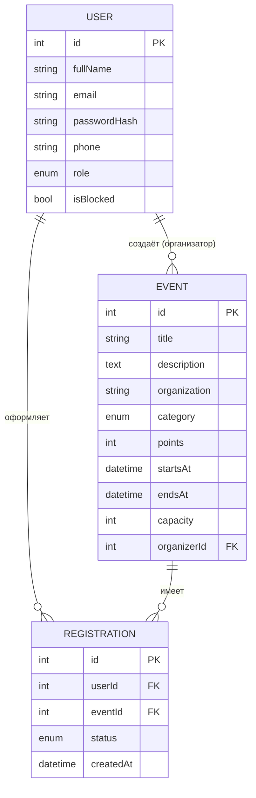
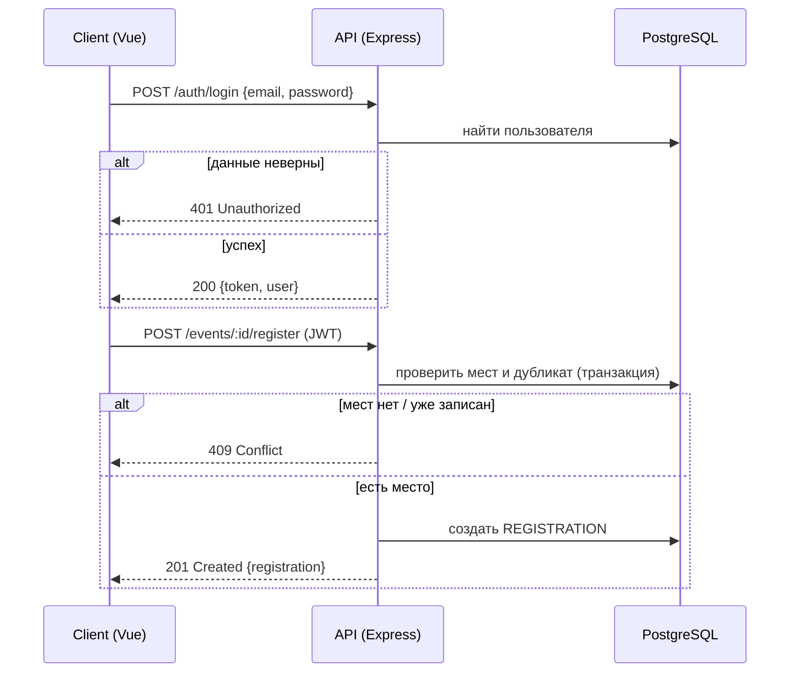

# Архитектура системы «Schoolify»

Платформа волонтёрской программы для учеников и студентов: просмотр и запись на
события по категориям, начисление очков и часов, уровни/бейджи и рейтинг
волонтёров, управление событиями организаторами, администрирование.

## 1. Общая схема

Трёхуровневая архитектура: клиент (SPA) → сервер (REST API) → база данных.



**Почему так:** клиент и сервер разделены и общаются только по HTTP/JSON. Это
позволяет разрабатывать фронт и бэк независимо, заменять любой слой и переиспользовать
API (например, под будущее мобильное приложение).

## 2. Frontend

| Решение | Что | Почему |
|---|---|---|
| Фреймворк | **Vue 3** (Composition API) | Лёгкий порог входа, реактивность, подходит для SPA с ролевой навигацией |
| Сборщик | **Vite** | Быстрый dev-сервер с HMR, простой prod-билд |
| Роутинг | **vue-router** | Маршруты-страницы + защита по ролям (guards) |
| Состояние | **Pinia** | Хранение текущего пользователя, токена, кеша мероприятий |
| HTTP | **axios** | Перехватчики (interceptors) для подстановки токена и обработки ошибок |

SPA отрисовывает интерфейс под роль (Гость / Студент / Организатор / Администратор):
гость видит только публичные страницы, остальное закрыто роут-гардами.

## 3. Backend

| Решение | Что | Почему |
|---|---|---|
| Среда | **Node.js** | Один язык (JS) на фронте и бэке |
| Фреймворк | **Express 5** | Минималистичный, гибкая система middleware |
| Структура | `routes → controllers → services → models` | Разделение ответственности, тестируемость |
| Авторизация | **JWT** (access-токен) | Stateless-аутентификация, удобна для SPA |
| Безопасность | **bcrypt** (хеш паролей), **cors**, валидация входных данных | Базовая защита учётных данных и API |

Слои:
- **routes** — описание эндпоинтов, подключение middleware;
- **middleware** — проверка JWT, проверка роли, единый обработчик ошибок;
- **controllers** — разбор запроса, вызов сервиса, формирование ответа;
- **services** — бизнес-логика (проверка свободных мест, защита от повторной записи);
- **models** — доступ к данным через ORM.

## 4. База данных

**Выбор: PostgreSQL + ORM (Prisma).**

- Данные строго реляционные: пользователи, мероприятия, регистрации связаны
  отношениями «один-ко-многим» и «многие-ко-многим» → реляционная БД естественна.
- Нужна целостность (нельзя зарегистрироваться дважды, нельзя превысить лимит мест) —
  это решается ограничениями БД (UNIQUE, FK) и транзакциями.
- **Prisma** даёт типобезопасные модели, миграции и единый `schema.prisma`, который
  одновременно служит источником ER-диаграммы.

> Альтернатива для локальной разработки без установки сервера БД — **SQLite**
> (тот же Prisma, смена одной строки в конфиге). MongoDB не выбран: данные
> реляционные, а не документные.

Основные сущности (подробно — в `er-diagram.md`):



## 5. API

- Стиль: **REST**, формат **JSON**, префикс и версия — **`/api/v1`**.
- Ресурсы: `auth`, `events`, `registrations`, `profile`, `users`, `rating`, `notifications`, `admin/users`.
- Коды ответов: `200/201` успех, `400` валидация, `401` нет авторизации,
  `403` нет прав, `404` не найдено, `409` конфликт (мест нет / уже записан),
  `500` ошибка сервера.

Примеры (полный контракт — в `api-contract.md`):

| Метод | Путь | Роль | Назначение |
|---|---|---|---|
| POST | `/api/v1/auth/register` | все | регистрация (+ phone) |
| POST | `/api/v1/auth/login` | все | вход, выдача JWT |
| GET | `/api/v1/events` | все | список событий (`category/search/sort`) |
| GET | `/api/v1/events/:id` | все | детали события |
| POST | `/api/v1/events` | организатор | создать событие |
| POST | `/api/v1/events/:id/register` | студент | записаться |
| DELETE | `/api/v1/registrations/:id` | студент | отменить запись |
| GET | `/api/v1/profile` | auth | профиль + геймификация |
| GET | `/api/v1/users/:id` | auth | публичный профиль другого пользователя |
| GET | `/api/v1/rating` | auth | рейтинг волонтёров (`period`) |
| GET | `/api/v1/admin/users` | админ | управление пользователями |

## 6. Роли и доступ

| Роль | Доступ |
|---|---|
| **Гость** | только публичные эндпоинты (список и детали мероприятий) |
| **Студент** (волонтёр) | запись/отмена на события, профиль с очками/бейджами, рейтинг |
| **Организатор** | CRUD своих мероприятий, просмотр участников |
| **Администратор** | управление пользователями, модерация, полный доступ |

Доступ проверяется middleware: сперва валидность JWT, затем соответствие роли
требованиям эндпоинта.

## 7. Поток: регистрация на мероприятие

Соответствует блок-схеме из ТЗ (проверка данных входа + проверка свободных мест).



## 8. Геймификация

Очки, часы, уровень, бейджи и место в рейтинге **не хранятся в БД, а вычисляются**
из активных регистраций пользователя (единый источник истины — таблица
REGISTRATION + поля `points`/`startsAt`/`endsAt` события). Это исключает рассинхрон:
отмена записи автоматически откатывает показатели.

| Показатель | Как считается |
|---|---|
| `points` | сумма `event.points` по `ACTIVE`-регистрациям |
| `hours` | сумма `(endsAt − startsAt)` по событиям |
| `level` / прогресс | пороги: Новичок 0 · Участник 500 · Активист 1000 · Лидер 2000 · Легенда 3000 · Чемпион 5000 |
| `badges` | открыт, если `points ≥ порога` уровня |
| `rank` | позиция в рейтинге волонтёров; период `week/month/all` фильтрует по `createdAt` |

Логика вынесена в `server/src/services/gamification.service.js` (+ util
`utils/gamification.js`) и отдаётся через `GET /profile` и `GET /rating`.

## 9. Frontend (экраны)

SPA с нижней навигацией (тёмная тема): **Главная** (приветствие, прогресс уровня,
статы, ближайшие события), **События** (поиск + фильтр по категориям + карточки),
**Профиль** (аватар, уровень, бейджи, дневник активности, мои записи),
**Рейтинг** (подиум топ-3, периоды, «твоё место»), плюс экраны **Вход/Регистрация**.
Кабинет организатора и админ-панель доступны из профиля по роли.

## 10. Запуск (кратко)

```bash
npm run install:all     # установка зависимостей root/server/client
npm run dev             # параллельный запуск server + client
```

Подробная инструкция — в корневом `README.md`.
