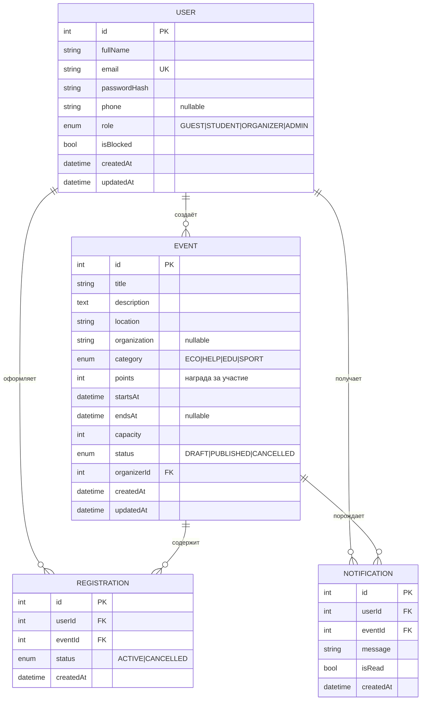

# ER-диаграмма «Schoolify»

Структура данных платформы волонтёрской программы: пользователи, мероприятия
(события), регистрации и уведомления. Источником истины служит
`server/prisma/schema.prisma` — данная диаграмма описывает те же сущности наглядно.

> **Геймификация считается, а не хранится.** Очки, часы, уровень, бейджи и место
> в рейтинге **выводятся из активных регистраций** (см. §5), поэтому отдельных
> полей `points/hours/level` в БД нет — это исключает рассинхрон.

## 1. Диаграмма



## 2. Сущности и атрибуты

### USER — пользователь
| Поле | Тип | Ограничения | Описание |
|---|---|---|---|
| id | int | PK, autoincrement | Идентификатор |
| fullName | string | not null | Имя и фамилия |
| email | string | **unique**, not null | Логин для входа |
| passwordHash | string | not null | Хеш пароля (bcrypt) |
| phone | string | nullable | Телефон (форма регистрации) |
| role | enum | not null, default `STUDENT` | GUEST / STUDENT / ORGANIZER / ADMIN |
| isBlocked | bool | default `false` | Блокировка администратором |
| createdAt | datetime | default now | Дата регистрации («Участник с …») |
| updatedAt | datetime | auto | Дата изменения |

### EVENT — мероприятие (событие)
| Поле | Тип | Ограничения | Описание |
|---|---|---|---|
| id | int | PK, autoincrement | Идентификатор |
| title | string | not null | Название |
| description | text | — | Подробное описание |
| location | string | — | Место проведения |
| organization | string | nullable | Учреждение-организатор («Чистый город») |
| category | enum | default `ECO` | ECO / HELP / EDU / SPORT (цветной тег) |
| points | int | default `0`, `>= 0` | Очки за участие (+120 pts) |
| startsAt | datetime | not null | Начало |
| endsAt | datetime | nullable | Окончание (диапазон времени + расчёт часов) |
| capacity | int | not null, `>= 0` | Лимит участников (0 = без лимита) |
| status | enum | default `DRAFT` | DRAFT / PUBLISHED / CANCELLED |
| organizerId | int | FK → USER.id | Создатель (организатор) |
| createdAt | datetime | default now | Дата создания |
| updatedAt | datetime | auto | Дата изменения |

### REGISTRATION — регистрация на мероприятие
| Поле | Тип | Ограничения | Описание |
|---|---|---|---|
| id | int | PK, autoincrement | Идентификатор |
| userId | int | FK → USER.id | Кто записался |
| eventId | int | FK → EVENT.id | На какое мероприятие |
| status | enum | default `ACTIVE` | ACTIVE / CANCELLED |
| createdAt | datetime | default now | Дата записи |

> **Уникальный составной ключ `(userId, eventId)`** — защита от повторной записи.
> Регистрация — ещё и **источник геймификации**: очки/часы пользователя = сумма
> по его `ACTIVE`-регистрациям.

### NOTIFICATION — уведомление
| Поле | Тип | Ограничения | Описание |
|---|---|---|---|
| id | int | PK, autoincrement | Идентификатор |
| userId | int | FK → USER.id | Получатель |
| eventId | int | FK → EVENT.id (nullable) | Связанное мероприятие |
| message | string | not null | Текст уведомления |
| isRead | bool | default `false` | Прочитано ли |
| createdAt | datetime | default now | Дата создания |

## 3. Связи

| Связь | Тип | Описание |
|---|---|---|
| USER → EVENT | 1 : N | Организатор создаёт много мероприятий (`organizerId`) |
| USER → REGISTRATION | 1 : N | Один волонтёр имеет много регистраций |
| EVENT → REGISTRATION | 1 : N | На одно мероприятие — много регистраций |
| USER ↔ EVENT | M : N | Реализуется через REGISTRATION (волонтёр ↔ мероприятия) |
| USER → NOTIFICATION | 1 : N | Пользователь получает много уведомлений |
| EVENT → NOTIFICATION | 1 : N | Мероприятие порождает уведомления (опционально) |

## 4. Бизнес-правила, отражённые в схеме

- **Нельзя записаться дважды** → UNIQUE `(userId, eventId)` в REGISTRATION.
- **Нельзя превысить лимит** → `COUNT(REGISTRATION WHERE status=ACTIVE) < capacity`
  в транзакции при записи.
- **Отмена не удаляет запись**, а ставит `status = CANCELLED` → история и откат очков.
- **Роль определяет права** → поле `role` в USER, проверяется в middleware.
- **Гость** не хранится в БД — это пользователь без JWT (публичный доступ к чтению).

## 5. Геймификация (вычисляемые показатели)

Не хранятся в БД, считаются на лету из `ACTIVE`-регистраций пользователя:

| Показатель | Формула |
|---|---|
| `points` | сумма `event.points` по регистрациям |
| `hours` | сумма длительностей `(endsAt − startsAt)` |
| `eventsCount` | число регистраций |
| `level` / прогресс | пороги очков: Новичок 0 · Участник 500 · Активист 1000 · Лидер 2000 · Легенда 3000 · Чемпион 5000 |
| `badges` | Новичок…Легенда, открыт, если `points ≥ порога` |
| `rank` | позиция в рейтинге волонтёров (сортировка по очкам) |

Рейтинг за период (`week`/`month`/`all`) фильтрует регистрации по `createdAt`.

## 6. Соответствие схемы Prisma

> Для прототипа БД — **SQLite**, где enum не поддерживается, поэтому `role`,
> `category`, `status` хранятся строками с дефолтами. Ниже — целевой вид для
> PostgreSQL с enum; фактический `schema.prisma` использует `String`.

```prisma
enum Role { GUEST STUDENT ORGANIZER ADMIN }
enum EventStatus { DRAFT PUBLISHED CANCELLED }
enum EventCategory { ECO HELP EDU SPORT }
enum RegistrationStatus { ACTIVE CANCELLED }

model User {
  id            Int      @id @default(autoincrement())
  fullName      String
  email         String   @unique
  passwordHash  String
  phone         String?
  role          Role     @default(STUDENT)
  isBlocked     Boolean  @default(false)
  events        Event[]
  registrations Registration[]
  notifications Notification[]
  createdAt     DateTime @default(now())
  updatedAt     DateTime @updatedAt
}

model Event {
  id            Int      @id @default(autoincrement())
  title         String
  description   String?
  location      String?
  organization  String?
  category      EventCategory @default(ECO)
  points        Int      @default(0)
  startsAt      DateTime
  endsAt        DateTime?
  capacity      Int      @default(0)
  status        EventStatus @default(DRAFT)
  organizer     User     @relation(fields: [organizerId], references: [id])
  organizerId   Int
  registrations Registration[]
  notifications Notification[]
  createdAt     DateTime @default(now())
  updatedAt     DateTime @updatedAt
}

model Registration {
  id        Int      @id @default(autoincrement())
  user      User     @relation(fields: [userId], references: [id])
  userId    Int
  event     Event    @relation(fields: [eventId], references: [id])
  eventId   Int
  status    RegistrationStatus @default(ACTIVE)
  createdAt DateTime @default(now())

  @@unique([userId, eventId])
}

model Notification {
  id        Int      @id @default(autoincrement())
  user      User     @relation(fields: [userId], references: [id])
  userId    Int
  event     Event?   @relation(fields: [eventId], references: [id])
  eventId   Int?
  message   String
  isRead    Boolean  @default(false)
  createdAt DateTime @default(now())
}
```
